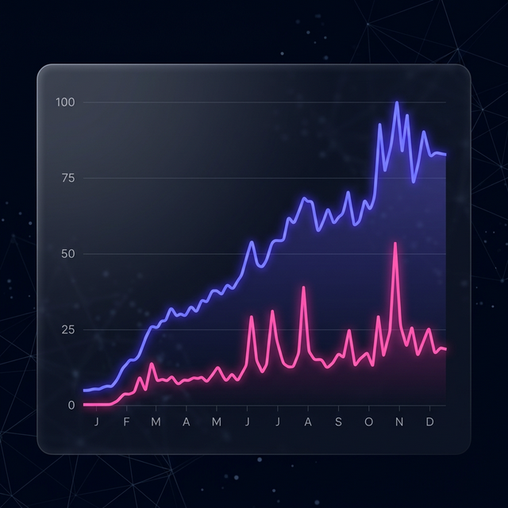

# AI 트렌드 인사이트

## Gemini vs Claude 1년 추이 분석

<!-- 
안녕하십니까? 이번 발표는 네이버 데이터랩 API를 활용한 Google Gemini와 Anthropic Claude의 지난 1년간의 검색 트렌드 분석 결과를 주제로 진행하겠습니다. 
-->

---

## 1. 프로젝트 개요 🚀

- **분석 대상**: Google Gemini & Anthropic Claude
- **데이터 소스**: **Naver DataLab** 통합검색어 API
- **수집 기간**: 2025.03.08 ~ 2026.03.06 (364일)
- **목표**: 인공지능 모델의 국내 인지도 및 검색 트렌드 비교

<!-- 
본 프로젝트는 국내 인공지능 모델의 인지도를 비교하기 위해 2025년 3월부터 약 1년 동안의 네이버 검색 데이터를 수집했습니다. 특히 대중적인 관심도가 실제 기술 발표나 업데이트에 어떻게 반응하는지를 중점적으로 보았습니다.
-->

---

## 2. 데이터 수집 결과 📊

- **총 데이터 수**: 364건 (일별 수집)
- **최고 수치(Peak)**:
  - Gemini: **100.0** (2026.03.05)
  - Claude: **10.8** (2026.03.03)
- **수집 파일**: `data/ai_trend_data.csv`
- **특이사항**: 두 모델 모두 최근 1개월 내 역대 최고치 경신

<!-- 
총 364건의 일별 데이터를 분석한 결과, Gemini는 최고 100점의 만점을 기록하며 압도적인 검색량을 보였습니다. Claude 역시 상대적으로 수치는 낮지만 최근 3월 초에 역대 최고치를 경신하며 가파른 성장세를 보이고 있습니다.
-->

---

## 3. 심층 트렌드 분석: Gemini vs Claude 📈

### 데이터가 증명하는 성장세

- **Gemini**: 시장 지배력 확대
  - 1년 평균 **20.0** 상회
  - 최근 검색량 폭발적 증가
- **Claude**: 빠른 추격과 반응성
  - 업데이트 마다 **급격한 스파이크**
  - 특정 커뮤니티 내 강력한 인지도

<!-- 
이제 구체적인 트렌드로 들어가 보겠습니다. 우측 차트를 보시면 인디고 색상의 Gemini가 시장 전반을 주도하고 있음을 알 수 있습니다. 특히 하반기 들어 그 격차를 더 벌리고 있죠. 반면 핑크색의 Claude는 평균치는 낮지만, 기술적인 업데이트가 있을 때마다 매우 날카로운 반응을 보이며 시장 파이를 나누고 있습니다.
-->

---

## 3-1. 수치로 보는 이동평균 및 상관관계 🔍

### "함께 성장하는 AI 생태계"

- **7일 이동평균선**: 노이즈 제거 시 안정적 우상향 곡선
- **상관계수 0.7+**: 두 모델의 검색량은 매우 유사한 패턴으로 움직임
- **시사점**: 경쟁 관계이면서도 상호 보완적으로 **AI에 대한 대중적 관심**을 견인 중

<!-- 
이 차트를 이동평균선으로 분석해 보면, 단순한 우연이 아니라 트렌드 자체가 견고하게 상승하고 있다는 것을 알 수 있습니다. 주목할 점은 상관계수가 0.7 이상이라는 것인데요. 이는 한 모델이 뜨면 다른 모델도 함께 찾아보는, 즉 사용자들이 두 모델을 활발하게 비교하며 사용하고 있다는 강력한 증거입니다.
-->

---

## 4. 주기성 분석: 언제 검색하는가? 📅

- **요일별 패턴**: 주로 **주중(화~목)**에 검색량이 집중됨
- **Work-Life Pattern**: 업무 및 학습 목적으로의 활용도가 매우 높음을 시사
- **성장세**: Gemini는 하반기 들어 상승폭이 더욱 가팔라짐

<!-- 
검색 주기 또한 흥미로운 결과를 보여줍니다. 주말보다는 평일, 특히 화요일에서 목요일 사이에 검색량이 집중됩니다. 이는 사용자들이 단순히 재미로 AI를 써보는 것이 아니라, 실제 업무나 학습 현장에서 도구로서 진지하게 활용하고 있다는 점을 시사합니다.
-->

---

## 5. 결론 및 인사이트 💡

1. **차별적 우위**: Gemini의 대중적 인지도가 현재 매우 강력함
2. **시장 동향**: AI 기술에 대한 일반 사용자 관심도가 1년 새 **수배 상승**
3. **제언**: 특정 요일(주중) 집중 마케팅/업데이트 배포가 효율적
4. **확장**: 쇼핑 트렌드와 연계 시 실질적 구매 의향 파악 가능

<!-- 
결론적으로 Gemini의 대중적 인지도는 이미 확고한 상태이며 시장 자체도 1년 전보다 수배 이상 커졌습니다. 마케팅이나 정보 배포 시 주중을 타겟팅하는 것이 효율적이며, 향후 쇼핑 트렌드와 연계한다면 실질적인 유료 전환 의향까지 분석 가능할 것으로 보입니다.
-->

---

## 6. 대시보드 및 리포트 🔗

- **인터랙티브 대시보드**: [http://localhost:5173/](http://localhost:5173/)
- **상세 보고서**: `walkthrough.md` 참조
- **발표 도구**: Marp for VS Code 활용 권장

<!-- 
현재 이 데이터는 로컬 대시보드에서 인터랙티브한 차트로 실시간 시연이 가능합니다. 상세한 수치는 분석 보고서를 참고해 주시기 바랍니다. 
-->

---

### 감사합니다

### Q&A

<!-- 
이상으로 발표를 마치겠습니다. 질문이 있으시면 편하게 말씀해 주시기 바랍니다. 감사합니다.
-->
